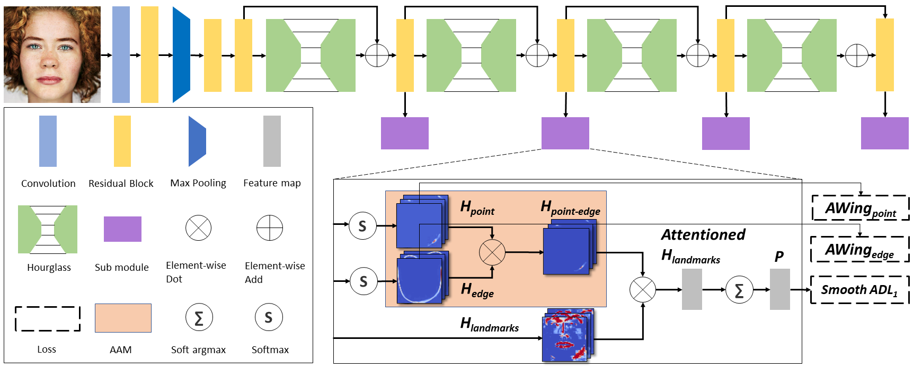

# ADNet: Leveraging Error-Bias Towards Normal Direction in Face Alignment

Paper link: [ICCV 2021](https://arxiv.org/pdf/2109.05721.pdf)

Updated: 04/29/2022

## Structure
| Folder           | Description                                       |
| :----------------| :-------------------------------------------------|
| conf             | Configure files of different training tasks.      |
| lib              | Core implementation of all kinds of backbones, data loaders, losses and optimizers. |
| main.py          | Entry script for training, testing or conversion. |
| trainer.py       | Entry script for model training.                  |
| tester.py        | Entry script for model testing.                   |
| evaluate.py      | Evaluate script for model NME metrics calculation and visualization. |
| requirements.txt | The dependency list in python.                    |

## Dependencies
Local machine:
* python==3.7.3
* torch==1.6.0
* requirements.txt
* GPU running option requires:
    * Installing [CUDA 10.1](https://developer.nvidia.com/cuda-10.1-download-archive) (Runtime + SDK) and configuring *NVCC* root directory into *ENVIRONMENT PATH*

## Resources

| Dataset          | Dataset      | Metadata (train, test)| Model (pytorch, onnx) |
| :----------------| :------------| :-------------------- | :-------------------- |
| COFW             | [official](https://data.caltech.edu/records/bc0bf-nc666) | [google](https://drive.google.com/drive/folders/1sg1cZEZoYBxr6hhIdCoykhKhYQt2yKLn?usp=sharing) / [baidu](https://pan.baidu.com/s/1xncDsgy5G_OzrRZsd85xAQ?pwd=wf7h)  | [google](https://drive.google.com/drive/folders/1I8hXk3QwHSTdg63I1p4VcrzRfvAO5kWm?usp=sharing) / [baidu](https://pan.baidu.com/s/1le4PdhwTTmTJyjpSjF5iJg?pwd=2kwg)  |
| 300W             | [official](https://ibug.doc.ic.ac.uk/resources/300-W/)             | [google](https://drive.google.com/drive/folders/12FMfwp10zmsHm5ngvwXuN7Z5vBFd_Ltu?usp=sharing) / [baidu](https://pan.baidu.com/s/1oCMWoHuz1K8flvDyA8W0cQ?pwd=xm5z)  | [google](https://drive.google.com/drive/folders/193KichBpbSG9IdgJVw-GK47hmFDcPaib?usp=sharing) / [baidu](https://pan.baidu.com/s/1JOTkOR3CUbq2I5SCBYszyw?pwd=tpsn)  |
| WFLW             | [official](https://wywu.github.io/projects/LAB/WFLW.html)          | [google](https://drive.google.com/drive/folders/1fRwu2x5Rhqflagq85CtVooegO16jFDLr?usp=sharing) / [baidu](https://pan.baidu.com/s/1Ng_hdcaANIW5LG8y9sQncw?pwd=b36h)  | [google](https://drive.google.com/drive/folders/1jkJ0VruvJJNtsBruqdUMxQwpWtA9dxkk?usp=sharing) / [baidu](https://pan.baidu.com/s/1OVhKXhZidODscEP9Tzzxtg?pwd=dhjd)  |

## Preparation
 - Step1: Install dependencies.
 - Step2: Clone repo.
 - Step3: Download dataset and metadata of each dataset to data/alignment/*${dataset}* folder.
 - Step4: Set the target dataset through configuring the *${data_definition}* variable in conf/alignment.py script.
 - Step5: Run the scripts below.

## Training in local machine
```script
python main.py --mode=train --config_name=alignment --device_ids=0,1,2,3
```

## Testing in local machine
```script
python main.py --mode=test --config_name=alignment --pretrained_weight=${model_path} --device_ids=0
```

## Evaluation in local machine
```script
python evaluate.py --mode=nme --config_name=alignment --model_path=${model_path} --metadata_path==${metadata_path} --image_dir=${image_dir} --device_ids=0
```

## Framework
The framework of ADNet.


## Performance
Table 1. Comparing with state-of-the-art methods on **COFW** by *NME<sub>inter-pupils</sub>*.

| Method    | NME       | FR<sub>10%</sub> | AUC<sub>10%</sub> |
| --------- | --------- | ---------------- | ----------------- |
| Human     | 5.60      | -                | -                 |
| RCPR      | 8.50      | 20.00            | -                 |
| TCDCN     | 8.05      | -                | -                 |
| DAC-CSR   | 6.03      | 4.73             | -                 |
| Wu et al  | 5.93      | -                | -                 |
| Wing      | 5.44      | 3.75             | -                 |
| DCFE      | 5.27      | 7.29             | 0.3586            |
| Awing     | 4.94      | 0.99             | **0.6440**        |
| **ADNet** | **4.68**  | **0.59**         | 0.5317            |

Table 2. Comparing with state-of-the-art methods on **300W** by *NME<sub>inter-pupils</sub>*.

| Method    | Common Subset  | Challenging Subset | Fullset     |
| --------- | -------------- | ------------------ | ----------- |
| PCD-CNN   | 3.67           | 7.62               | 4.44        |
| CPM+SBR   | 3.28           | 7.58               | 4.10        |
| SAN       | 3.34           | 6.60               | 3.98        |
| LAB       | 2.98           | 5.19               | 3.49        |
| DeCaFA    | 2.93           | 5.26               | 3.39        |
| DU-Net    | 2.90           | 5.15               | 3.35        |
| LUVLi     | 2.76           | 5.16               | 3.23        |
| AWing     | 2.72           | **4.52**           | 3.07        |
| --------- | -------------- | ------------------ | ----------- |
| **ADNet** | **2.53**       | 4.58               | **2.93**    |

Table 3. Comparing with state-of-the-art methods on **WFLW** by *NME<sub>inter-ocular</sub>*.

| Method    | Testset           | Pose Subset         | Expression Subset    | Illumination Subset | Make-up Subeset  | Occlusion Subset | Blur Subset          |
| --------- | ----------------- | ------------------- | -------------------- | ------------------- | ---------------- | ---------------- | -------------------- |
| ESR       | 11.13             | 25.88               | 11.47                | 10.49               | 11.05            | 13.75            | 12.20                |
| SDM       | 10.29             | 24.10               | 11.45                | 9.32                | 9.38             | 13.03            | 11.28                |
| CFSS      | 9.07              | 21.36               | 10.09                | 8.30                | 8.74             | 11.76            | 9.96                 |
| DVLN      | 6.08              | 11.54               | 6.78                 | 5.73                | 5.98             | 7.33             | 6.88                 |
| LAB       | 5.27              | 10.24               | 5.51                 | 5.23                | 5.15             | 6.79             | 6.12                 |
| Wing      | 5.11              | 8.75                | 5.36                 | 4.93                | 5.41             | 6.37             | 5.81                 |
| DeCaFA    | 4.62              | 8.11                | 4.65                 | 4.41                | 4.63             | 5.74             | 5.38                 |
| Awing     | 4.36              | 7.38                | 4.58                 | 4.32                | 4.27             | 5.19             | 4.96                 |
| LUVLi     | 4.37              | -                   | -                    | -                   | -                | -                | -                    |
| **ADNet** | **4.14**          | **6.96**            | **4.38**             | **4.09**            | **4.05**         | **5.06**         | **4.79**             |

## Citation

```text
@inproceedings{huang2021adnet,
  title={Adnet: Leveraging error-bias towards normal direction in face alignment},
  author={Huang, Yangyu and Yang, Hao and Li, Chong and Kim, Jongyoo and Wei, Fangyun},
  booktitle={Proceedings of the IEEE/CVF International Conference on Computer Vision},
  pages={3080--3090},
  year={2021}
}
```

## License

    The project is released under the MIT License
